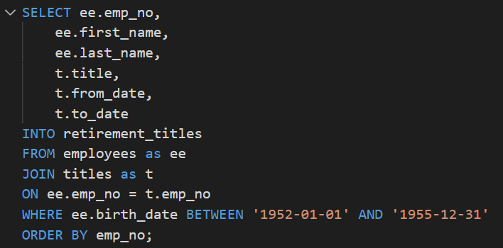
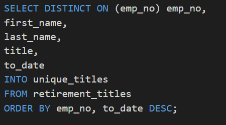
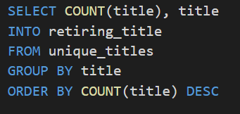
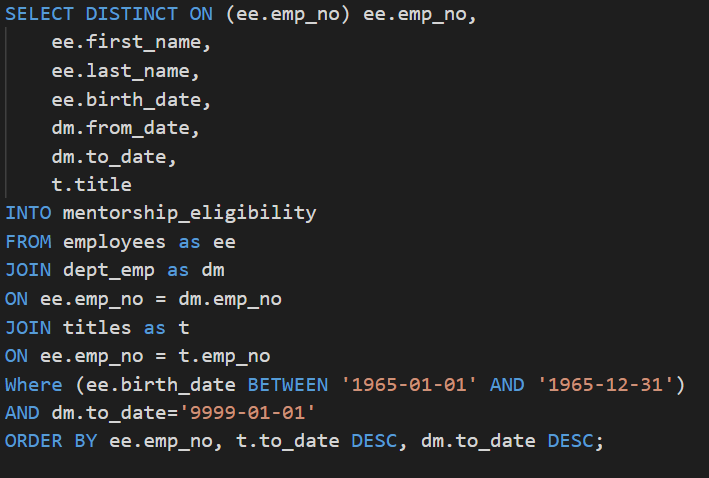
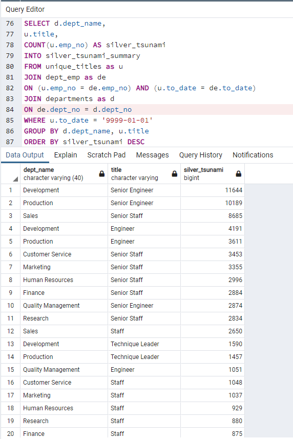
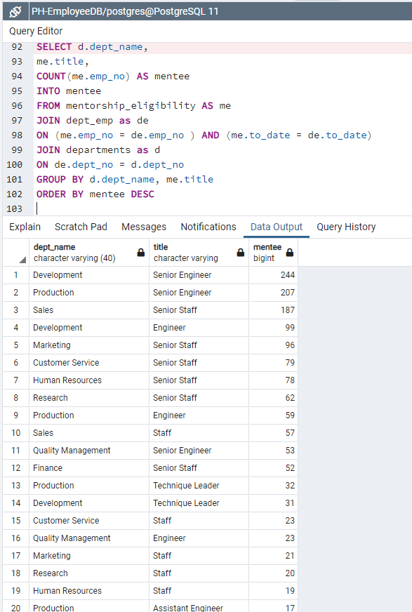
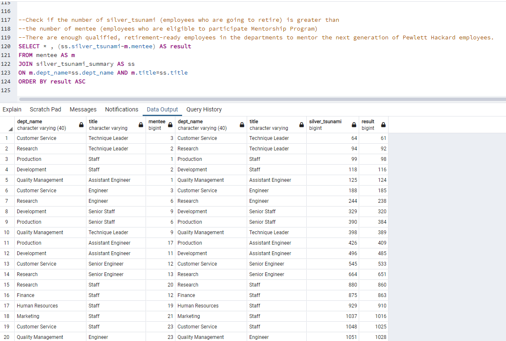

# Pewlett-Hackard-Analysis

## Overview of the analysis
The project is to help Bobby, a HR analyst works in Pewlett Hackard, to build employee database from the csv files with SQL to find the number of retiring employees per title and identify employees who are eligible to participate in a mentorship program.

## Results
* Deliverable 1: The Number of Retiring Employees by Title

 1. To create Retirement Titles table containing employee number, first name, last name, title, from date and to date, we use JOIN function with employees and title table on employee number and then filtering employees born during 1954 to 1955. However, some employees may have multiple titles because promotion records are kept in the database.

 2. On top of Retirement Titles table, we use DISTINCT function to remove duplicate rows and keep the latest job title in the list. Distinct function keeps only the first row of each set of rows so that we use ORDER BY on to_date in descending order to ensure that latest title appears the first row. In this way, Distinct function will delete history title and keep latest title information and then we can generate unique titles table which include only the most recent title information.

 3. To calculate the number of employees who are about to retire and summarize by title, we use COUNT and GROUP BY function to count the number of employees by their most recent job title group. Then use ORDER BY function to present count number in descending order.

* Deliverable 2: The Employees Eligible for the Mentorship Program

 4. We use JOIN function with employees, dept_emp and title table on emp_no to include emp_no, first_name, last_name, birth_date, from_date, to_date, and title information into Mentorship-eligibility table. To filter out the current employees born in 1965, we have to apply “WHERE (ee.birth_date BETWEEN '1965-01-01' AND '1965-12-31') AND dm.to_date='9999-01-01'.” Then, since there may have multiple records for one because promotion records are kept in the database, we have to sort to_date in descending order in titles and emp_dept tables to make sure the latest data will be the first row of each employee rows.

## Summary

* How many roles will need to be filled as the "silver tsunami" begins to make an impact?

  In order to count how many roles will need to be filled in each department, we need to filter out current employees who are born during 1954 to 1955 and summarize the number of employees according to what their title is and what department they work for. 

  As unique_titles generated in Deliverable 1 provides employees who are eligible to retire information, emp_no, first name, last name and title, we can count the numbers of upcoming “silver tsunami” employee number from unique_titles. To include department name in the summary, we join unique_titles table and dept_emp table on emp_no and to_date so that dept_no information is included to be the join key to add dept_name from departments table. However, unique_titles table contains employees who already retired so that we filter out employees whose to_date records show "9999-01-01" in dept_emp table by applying “WHERE u.to_date = '9999-01-01'.” Finally, we use GROUP BY dept_name and title to summarize the silver tsunami numbers into the new table silver_tsunami_summary.

  Please see picture below. It is code of silver_tsunami_summary and partial summary. From the table, we can what roles are going to retire soon in what department will need to be filled. The first is 11,644 Senior Engineer in Development department, the second is 10,189 Senior Engineer in Production department, and the third is 8,685 Senior Staff in Sales.

* Are there enough qualified, retirement-ready employees in the departments to mentor the next generation of Pewlett Hackard employees?

  From above, we know how many employees are going to retire soon in titles and departments. Therefore, we can know if there are enough montors to coach next generation by comparing the summary of the employees who are eligible to participate in mentorship program with silver_tsunami_summary.

  As mentorship_eligibility table made in Deliverable 2 provided the list of employees who are eligible for mentorship, we can select and join mentorship_eligibility table with dept_emp table on emp_no and to_date so that dept_no information is included to be the join key to add dept_name from departments table. Then we use GROUP BY dept_name and title to summarize the mentee numbers into the new table mentee.

  Please see picture below. It is code of mentee and partial summary. From the table, we can know what role in what department will be eligible to mentorship program. The first is 244 Senior Engineer in Development department, the second is 207 Senior Engineer in Production department, and the third is 187 Senior Staff in Sales. Comparing with the number in silver_tsunami_summary, we have enough mentors to coach mentees.
  

  
  The result column below shows that the number of silver_tsunami, employees who are going to retire, is great than the number of mentees, employees who are eligible to participate Mentorship Program  means there are enough qualified, retirement-ready employees in the departments to mentor the next generation of Pewlett Hackard employees.
  

